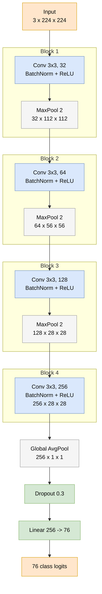
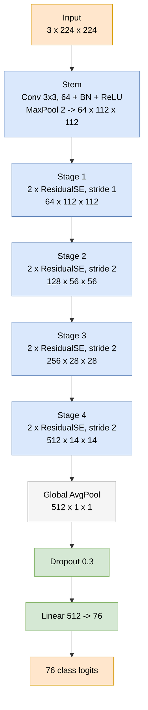
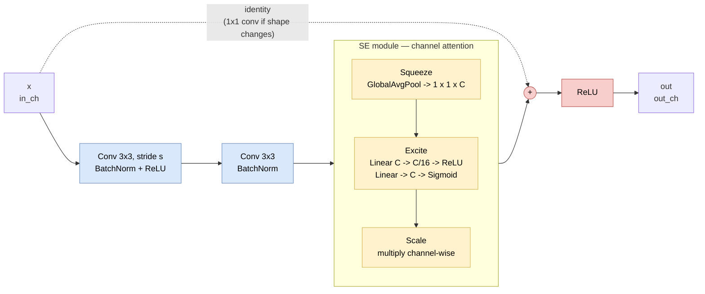
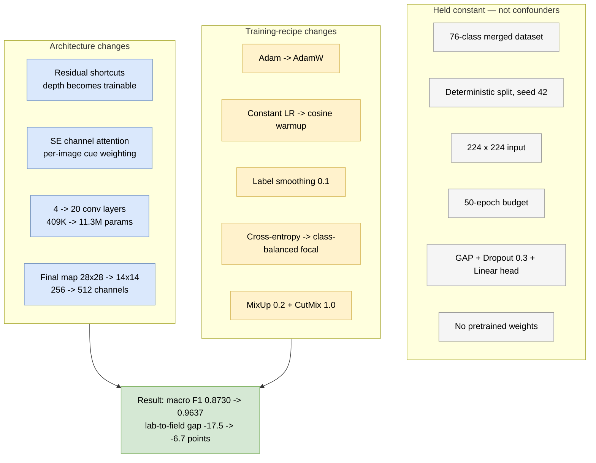

# Custom CNN v1 versus v2

Both networks are trained **entirely from scratch** on the same 76-class merged
dataset, under the same deterministic split and the same 50-epoch budget. They
exist as a matched pair: v2 changes the architecture *and* the training recipe,
so the comparison isolates how much of the gap to a pretrained model is due to
pretraining and how much is due to methodology.

All shapes below are traced from the actual modules in
[`plant_classifier/models.py`](../../plant_classifier/models.py) at a
`224 x 224` RGB input.

---

## v1 — plain convolutional stack

Four convolutions, each followed by BatchNorm, ReLU, and (for the first three)
a max-pool. No skip connections, no attention. The spatial map is collapsed by
global average pooling straight into a linear classifier.

**409K parameters · 4 convolutional layers · final feature map 28 x 28**

---

## v2 — residual stages with channel attention

The plain stack is replaced by a stem plus four residual stages, each holding
two `ResidualSEBlock`s. The classifier head is unchanged, so the head is *not*
a confounding variable in the comparison.

**11.3M parameters · 20 convolutional layers · final feature map 14 x 14**

---

## Inside one ResidualSEBlock

This is where the two architectural ideas live. The **identity shortcut** gives
gradients a direct path backwards, so depth stops being an optimization
obstacle. The **SE module** rescales channels using global context, letting the
block emphasise whichever cues matter for the current image.

---

## What actually differs

---

## Measured outcome

| | v1 | v2 |
|---|---|---|
| Parameters | 409K | 11.3M |
| Conv layers | 4 | 20 |
| Final feature map | 256 x 28 x 28 | 512 x 14 x 14 |
| Top-1 accuracy | 0.9222 | **0.9655** |
| Macro F1 | 0.8730 | **0.9637** |
| Epochs to val macro F1 0.80 | 30 | **16** |
| Best val macro F1 | 0.8711 | **0.9627** |
| Leafsnap lab -> field gap | **-17.5** pts | **-6.7** pts |
| Grad-CAM attention drift | **-0.229** | **-0.137** |

Two readings matter for the thesis.

First, v2 reaches 0.9637 macro F1 **with no pretrained weights at all** —
within 1.1 points of fine-tuned ResNet50 (0.9747) and about 9 points above
frozen ImageNet features (0.8737). On a dataset of this size, methodology
recovers most of what transfer learning is usually credited with.

Second, v2 more than halves the lab-to-field gap (-17.5 to -6.7), beating
ResNet50 feature extraction (-7.1) on that axis. The Grad-CAM drift moves the
same way (-0.229 to -0.137). Aggressive augmentation perturbs exactly the
nuisance factors that separate lab from field capture, so it buys
cross-condition robustness that frozen pretrained features do not.

**Caveat.** The two changes — architecture and training recipe — were applied
together, so this comparison cannot attribute the improvement between them. An
ablation running the v2 architecture under the v1 recipe (and vice versa) is
needed to separate the two, and is listed as future work.
